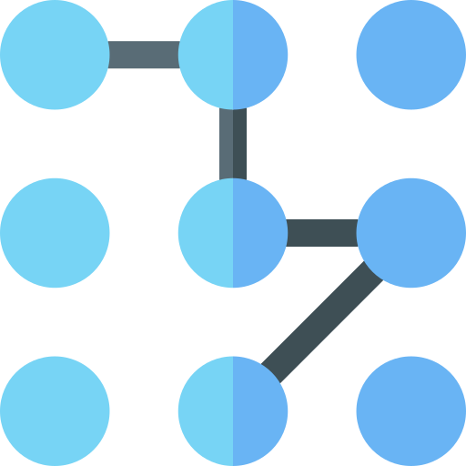
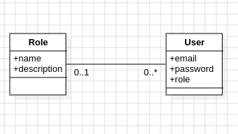

<h1>
    
    DESIGN PATTERN: PROTOTYPE 
</h1>
The Prototype pattern is a creational design pattern in software development. It allows an object, known as the prototype, to serve as a blueprint for creating new objects by copying its state. Instead of instantiating new objects through constructors, the Prototype pattern provides a mechanism for cloning existing objects. This approach is particularly useful when the cost of creating a new object is high or when object initialization is complex.

<h2>
    
    About project
</h2>

<p>
In this scenario, the Prototype design pattern is applied to manage user roles within an organizational system. The User and Role classes are utilized to create and assign roles to users. By employing the Prototype pattern, instances of User objects with predefined roles can be cloned, allowing for efficient creation of new user profiles while maintaining the integrity of role configurations. 
</p>

<h2>
    
    Class diagram
</h2>

<p align="center">
 
</p>

# Project structure

```
- 📁 src
  - 📁 main
    - 📁 java
      - 📁 com
        - 📁 example
          - 📁 domain
            - 📄 Role.java
            - 📄 User.java
            - 📄 Main.java
  - 📁 test
    - 📁 java
        - 📁 com
          - 📁 example
            - 📁 main
              - 📄 RoleTest.java
              - 📄 UserTest.java

```
